# RoadScanner

교통표지판 사진을 업로드하고 분석 결과를 확인할 수 있는 Spring MVC 기반 웹 애플리케이션입니다. 사진 선택부터 미리보기, 분석 결과 확인과 의견 제출까지 하나의 흐름으로 제공하며 Q&A, 비공개 문의와 관리자 운영 기능을 함께 지원합니다.

## 역할별 기능

| 역할 | 제공 기능 |
| --- | --- |
| 방문자 | 메인·서비스 소개, 로그인, 회원가입, 아이디·비밀번호 찾기, Q&A 목록·검색·상세 조회 |
| 회원 | 사진 분석과 의견 제출, 마이페이지, Q&A 작성·수정, 비공개 문의 작성과 답변 확인 |
| 관리자 | 계정 상태 관리, 문의 답변, 공지 관리, 이미지 데이터 관리, 분석 피드백 통계 |

## 주요 이용 흐름

- 사진 분석: 이미지 선택 → 미리보기 → 분석 실행 → 결과 확인 → 의견 제출
- 비공개 문의: 문의 작성 → 내 문의글 목록 → 문의 상세 → 관리자 답변 확인
- 관리자 운영: 계정·문의·공지·이미지 데이터 관리 → 분석 피드백 통계 확인

## 기능별 구현 및 시연

시연 화면은 현재 로컬 UI를 기준으로 새로 제작했습니다. 일반화된 로컬 테스트 데이터만 사용하며 실제 계정, 이메일, 운영 데이터나 자격증명을 포함하지 않습니다.

### 서비스 및 계정

#### 메인페이지와 서비스 소개

첫 화면의 주행 애니메이션, 서비스 소개, 이용 순서와 사진 분석 진입 흐름을 보여 줍니다. 첫 화면은 최적화된 애니메이션과 포스터 대체 이미지를 사용하고, 아래쪽 영상은 해당 영역에 가까워졌을 때 불러옵니다.

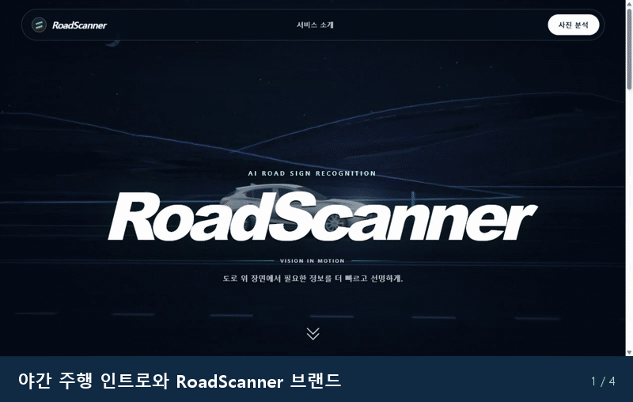

#### 로그인

로그인 양식과 인증 후 사진 분석 화면으로 이어지는 흐름을 보여 줍니다. 인증이 필요한 기능은 로그인 상태와 권한에 따라 접근을 제한합니다.

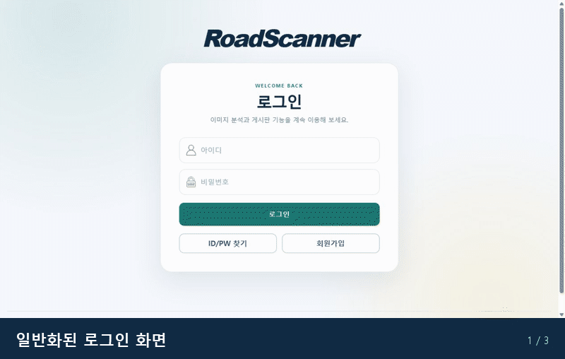

#### 회원가입

아이디, 비밀번호와 이메일 입력 양식을 제공하고 입력값 검증과 이메일 인증 흐름을 거쳐 계정을 생성합니다. 로컬 실행에서는 인증 메일을 외부로 보내지 않고 메모리 기반 메일함에서 확인합니다.

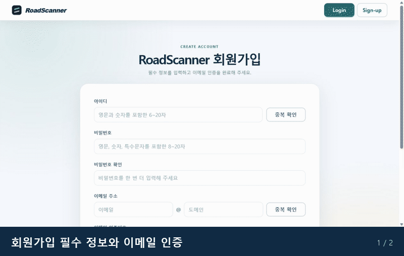

#### 아이디·비밀번호 찾기

이메일로 아이디를 찾거나 아이디와 이메일을 확인해 비밀번호 재설정 절차를 시작할 수 있습니다.

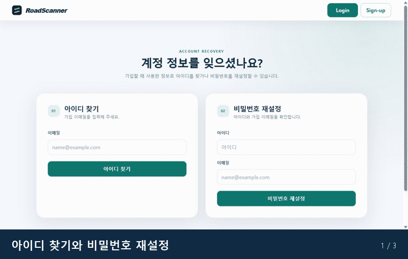

### 회원 기능

#### 마이페이지

아이디와 이메일을 읽기 전용으로 확인하고 비밀번호를 변경할 수 있습니다. 계정 정보와 비공개 문의 진입 동선을 한 화면에 제공합니다.

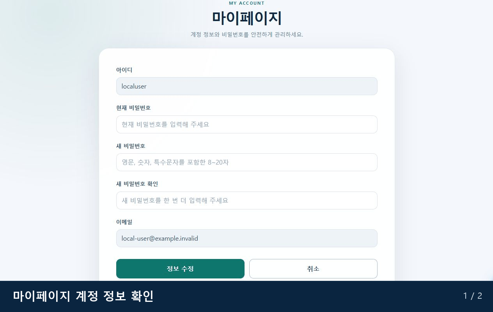

#### 비공개 문의

공개 Q&A 데이터와 분리된 문의를 작성하고 내 문의글 목록, 상세 내용, 답변 상태와 관리자 답변을 확인할 수 있습니다.

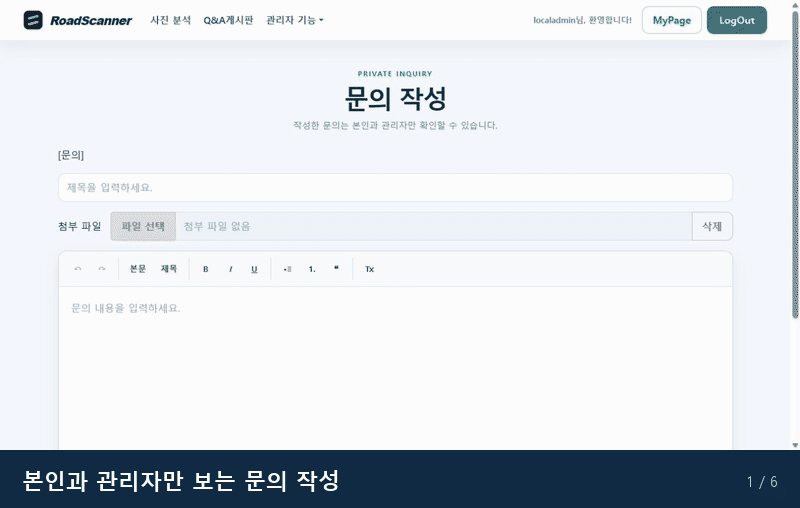

#### 사진 분석

드래그 앤 드롭 또는 파일 선택으로 이미지를 올리고 미리보기, 분석 결과와 의견 제출까지 이어집니다. 결과 화면을 닫으면 초기 업로드 화면으로 돌아가며, 의견을 보낸 뒤에는 결과를 계속 확인할 수 있습니다.

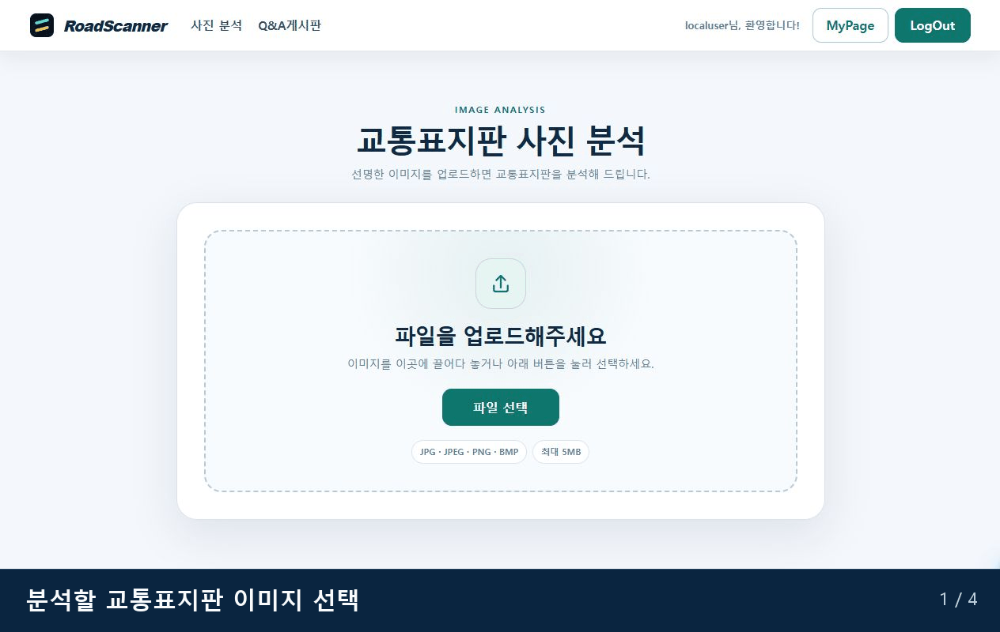

#### Q&A 게시판

공지와 일반 글을 함께 조회하고 분류·제목·내용 조건으로 검색할 수 있습니다. 페이징, 상세 조회와 서식 도구가 포함된 글쓰기·수정 화면을 제공합니다.

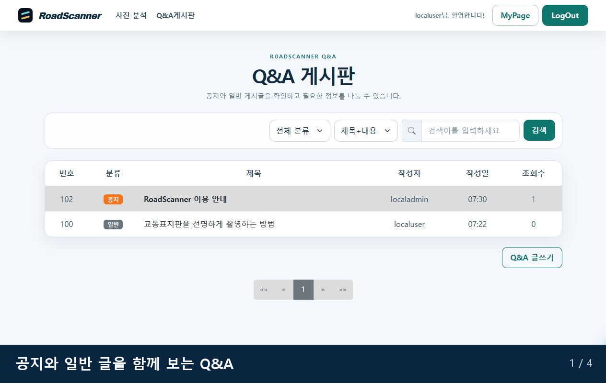

### 관리자 기능

#### 계정 관리

계정 현황과 일반 회원, 관리자, 이용 제한 계정 목록을 구분해 조회하고 검색할 수 있습니다.

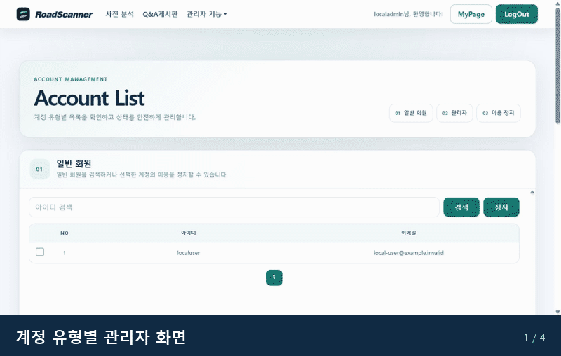

#### 이미지 데이터 관리

분석 이미지 목록을 상태별로 조회하고 선택한 이미지와 피드백 상세 정보를 한 화면에서 확인합니다.

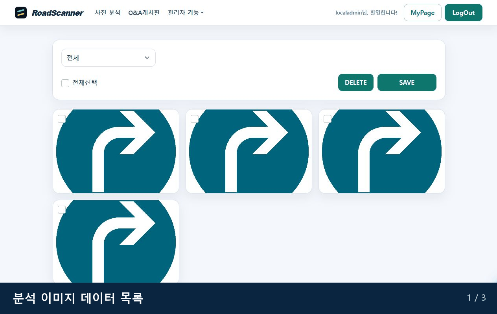

#### 분석 피드백 통계

싫어요 의견의 오류 유형별 누적 수치와 월별 추이를 차트로 확인합니다.

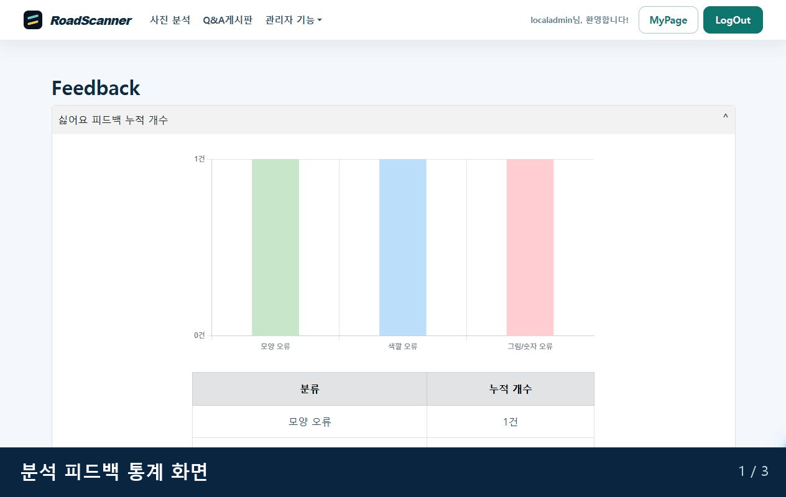

#### 문의 답변 관리

문의 상세에서 관리자 답변을 작성하고 저장된 답변을 확인하거나 수정할 수 있습니다.

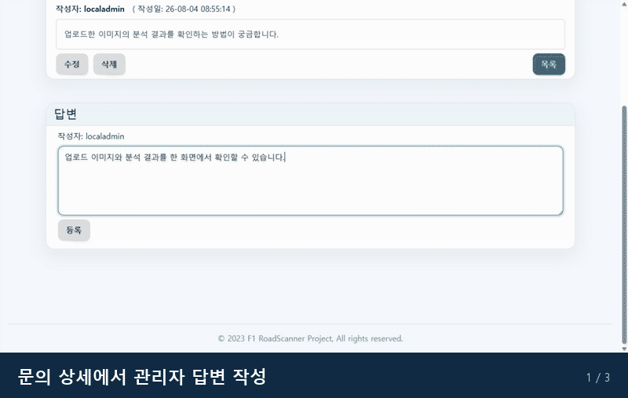

#### 공지 관리

공지 작성, Q&A 목록 상단 노출, 상세 조회와 수정 흐름을 제공합니다.

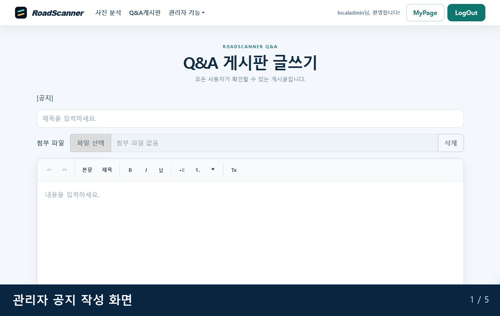

#### 문의 관리

전체 문의를 답변 상태별로 조회하고 상세 내용과 답변 영역을 함께 관리합니다.

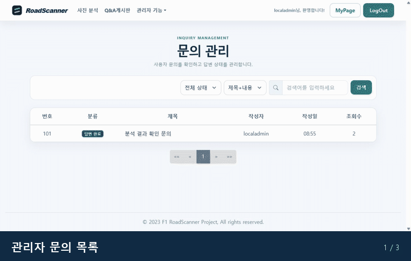

## 기술 구성

- Java 8, Spring MVC, MyBatis
- Oracle 호환 운영 DB, H2 기반 로컬·통합 테스트
- S3 호환 객체 스토리지
- Python 기반 교통표지판 검출·분류 서비스
- Maven, JUnit 4, JaCoCo

## 로컬 실행

실제 계정, 이메일, 호스트, 버킷, API 주소와 자격증명을 저장소 파일에 기록하지 않습니다. 필요한 값은 로컬 환경변수로만 주입하며 변수 목록은 `.env.example`을 참고합니다. `.env`, 로그, IDE 설정, 빌드 결과물과 키 파일은 Git 추적 대상에서 제외합니다.

### 외부 서비스 없이 실행

`local-smoke` 프로필은 프로세스 내부 H2 DB와 로컬 업로드·메일·분석 대체 구현을 사용합니다. 외부 DB, 객체 스토리지, SMTP 또는 분석 API에는 연결하지 않으며 서버는 `127.0.0.1:18080`에만 바인딩됩니다. 이 모드의 분석 대체 구현은 거짓 표지판 결과를 만들지 않고 항상 `인식 불가`를 반환합니다.

```powershell
$env:ROADSCANNER_LOCAL_PASSWORD = Read-Host "로컬 테스트 비밀번호"
mvn -B -Plocal-smoke -DskipTests jetty:run
```

실행 후 `http://127.0.0.1:18080/`에 접속합니다. 포트를 바꾸려면 다음처럼 Maven 속성 전체를 따옴표로 감쌉니다.

```powershell
mvn -B -Plocal-smoke -DskipTests "-Droadscanner.local.port=18081" jetty:run
```

비밀번호 정책을 만족하면 시작할 때 일반 사용자와 관리자용 임시 테스트 계정이 만들어집니다. 입력한 비밀번호는 파일이나 로그에 기록되지 않으며 서버를 종료하면 로컬 DB, 업로드와 메일 데이터가 함께 사라집니다. 로컬 메일함은 관리자 권한에서만 보이고 외부로 메일을 전송하지 않습니다.

### 실제 분석 모델 연결

새 체크아웃에서는 Git LFS 모델 파일을 먼저 복원합니다.

```powershell
git lfs install
git lfs pull --include="road_scanner.h5,traffic_sign_detector.onnx"
```

Python 추론 서비스를 실행합니다.

```powershell
python -m venv .venv
.\.venv\Scripts\python.exe -m pip install -r ml_service\requirements.txt
.\.venv\Scripts\python.exe -m ml_service.app
```

다른 터미널에서 실제 모델 연동 프로필을 실행합니다.

```powershell
$env:ROADSCANNER_LOCAL_PASSWORD = Read-Host "로컬 테스트 비밀번호"
mvn -B -Plocal-smoke -DskipTests "-Droadscanner.local.spring-profiles=local,local-ml" jetty:run
```

전체 사진에서 표지판 후보를 검출한 뒤 GTSRB 43종 분류기로 결과를 판정합니다. 검출 또는 신뢰도·OOD 안전 기준을 통과하지 못한 결과는 `인식 불가`로 처리합니다. 모델 복구 근거, 데이터셋, 학습·평가 명령과 도안 fallback 정책은 다음 문서를 참고합니다.

- [ML 복구 문서](docs/ml-recovery.md)
- [교통표지판 데이터셋](docs/traffic-sign-datasets.md)
- [교통표지판 검출기](docs/ml-detector.md)
- [표지 도안 프로토타입 fallback](docs/ml-design-prototype-fallback.md)

기존 운영 Oracle 스키마에 이 버전을 배포하기 전에는 먼저
[`src/main/resources/db/oracle-security-migration.sql`](src/main/resources/db/oracle-security-migration.sql)을
한 번 적용해야 합니다. 이 migration이 추가하는 `MEMBER.credential_version` 없이
새 로그인·세션 무효화 쿼리를 실행하면 배포 직후 인증 기능이 실패합니다. DB 변경과
애플리케이션 배포를 같은 변경 절차로 관리하고, 이미 적용한 migration은 다시 실행하지 마세요.

운영 Oracle에서 ML을 활성화하기 전에는 [교통표지판 결과 카탈로그 SQL](docs/db/oracle-traffic-sign-result-catalog.sql)을 검토·적용해야 합니다.

## 검증

```shell
mvn -B clean -Pintegration-tests verify
```

단위 테스트, H2 DAO 통합 테스트와 JaCoCo 커버리지 기준을 함께 검증합니다.

## 개인정보 보호

- 문서에 이름, 개인 계정, 외부 협업 문서와 개인 저장소 링크를 포함하지 않습니다.
- 테스트 데이터는 가상 계정과 예약된 테스트 도메인만 사용합니다.
- 운영 데이터와 자격증명은 별도의 로컬·배포 환경에서 관리합니다.
